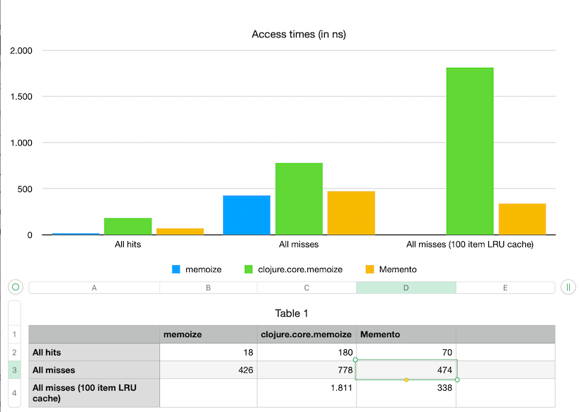

# Performance

Performance is not a dedicated goal of this library, but here's some numbers:



```clojure
; memoize is not thread-safe and doesn't have any features
(def f-memoize (memoize identity))
; clojure.core.memoize
(def f-core-memo (ccm/memo identity))
; memento
(def f-memento (m/memo identity {::m/type ::m/caffeine}))
```
## Memoize

#### All hits
```text
(cc/bench (f-memoize 1))
Evaluation count : 2911575540 in 60 samples of 48526259 calls.
             Execution time mean : 18,520670 ns
    Execution time std-deviation : 0,632964 ns
   Execution time lower quantile : 18,041806 ns ( 2,5%)
   Execution time upper quantile : 20,272312 ns (97,5%)
                   Overhead used : 1,997090 ns

Found 2 outliers in 60 samples (3,3333 %)
	low-severe	 2 (3,3333 %)
 Variance from outliers : 20,6200 % Variance is moderately inflated by outliers

```

#### 1M misses (426ns per miss)
```text
(cc/bench (let [f-memoize (memoize identity)]
            (reduce #(f-memoize %2) (range 1000000))))
Evaluation count : 180 in 60 samples of 3 calls.
             Execution time mean : 426,691729 ms
    Execution time std-deviation : 31,649211 ms
   Execution time lower quantile : 407,433346 ms ( 2,5%)
   Execution time upper quantile : 500,285216 ms (97,5%)
                   Overhead used : 1,997090 ns

Found 9 outliers in 60 samples (15,0000 %)
	low-severe	 5 (8,3333 %)
	low-mild	 4 (6,6667 %)
 Variance from outliers : 55,1467 % Variance is severely inflated by outliers
```

## Clojure Core Memoize

#### All hits

```text
(cc/bench (f-core-memo 1))
Evaluation count : 329229720 in 60 samples of 5487162 calls.
             Execution time mean : 180,803852 ns
    Execution time std-deviation : 3,880666 ns
   Execution time lower quantile : 177,830691 ns ( 2,5%)
   Execution time upper quantile : 189,061520 ns (97,5%)
                   Overhead used : 1,997090 ns

Found 6 outliers in 60 samples (10,0000 %)
	low-severe	 3 (5,0000 %)
	low-mild	 3 (5,0000 %)
 Variance from outliers : 9,4347 % Variance is slightly inflated by outliers
```

#### 1M misses (778 ns per miss)

```text
(cc/bench (let [f-core-memo (ccm/memo identity)]
            (reduce #(f-core-memo %2) (range 1000000))))
Evaluation count : 120 in 60 samples of 2 calls.
             Execution time mean : 778,758053 ms
    Execution time std-deviation : 58,068726 ms
   Execution time lower quantile : 717,950541 ms ( 2,5%)
   Execution time upper quantile : 947,641405 ms (97,5%)
                   Overhead used : 1,997090 ns

Found 6 outliers in 60 samples (10,0000 %)
	low-severe	 4 (6,6667 %)
	low-mild	 2 (3,3333 %)
 Variance from outliers : 55,1627 % Variance is severely inflated by outliers
```

#### 1M misses for size 100 LRU cache (1811 ns per miss)

```text
(cc/bench (let [f-core-memo (ccm/lru identity :lru/threshold 100)]
            (reduce #(f-core-memo %2) (range 1000000))))
Evaluation count : 60 in 60 samples of 1 calls.
             Execution time mean : 1,811235 sec
    Execution time std-deviation : 23,960121 ms
   Execution time lower quantile : 1,773504 sec ( 2,5%)
   Execution time upper quantile : 1,866470 sec (97,5%)
                   Overhead used : 1,997090 ns

Found 2 outliers in 60 samples (3,3333 %)
	low-severe	 2 (3,3333 %)
 Variance from outliers : 1,6389 % Variance is slightly inflated by outliers

```

## Memento

#### All hits

```text
(cc/bench (f-memento 1))

Evaluation count : 1708957080 in 60 samples of 28482618 calls.
             Execution time mean : 33,495114 ns
    Execution time std-deviation : 1,526886 ns
   Execution time lower quantile : 32,420293 ns ( 2,5%)
   Execution time upper quantile : 35,210809 ns (97,5%)
                   Overhead used : 1,997090 ns

Found 3 outliers in 60 samples (5,0000 %)
	low-severe	 1 (1,6667 %)
	low-mild	 2 (3,3333 %)
 Variance from outliers : 31,9409 % Variance is moderately inflated by outliers
```

#### 1M misses (219 ns per miss)

```text
(cc/bench (let [f-memento (m/memo identity {::m/type ::m/caffeine})]
            (reduce #(f-memento %2) (range 1000000))))
Evaluation count : 360 in 60 samples of 6 calls.
             Execution time mean : 219,945619 ms
    Execution time std-deviation : 42,439269 ms
   Execution time lower quantile : 168,508054 ms ( 2,5%)
   Execution time upper quantile : 294,514408 ms (97,5%)
                   Overhead used : 1,997090 ns

Found 1 outliers in 60 samples (1,6667 %)
	low-severe	 1 (1,6667 %)
 Variance from outliers : 89,4334 % Variance is severely inflated by outliers
=> nil
```

#### 1M misses for size 100 LRU cache (202 ns per miss)

```text
(cc/bench (let [f-memento (m/memo {::m/size< 100 ::m/type ::m/caffeine} identity)]
            (reduce #(f-memento %2) (range 1000000))))
Evaluation count : 660 in 60 samples of 11 calls.
             Execution time mean : 100,564314 ms
    Execution time std-deviation : 5,061328 ms
   Execution time lower quantile : 93,667858 ms ( 2,5%)
   Execution time upper quantile : 108,149131 ms (97,5%)
                   Overhead used : 1,997090 ns

Found 2 outliers in 60 samples (3,3333 %)
	low-severe	 1 (1,6667 %)
	low-mild	 1 (1,6667 %)
 Variance from outliers : 36,8226 % Variance is moderately inflated by outliers

```
