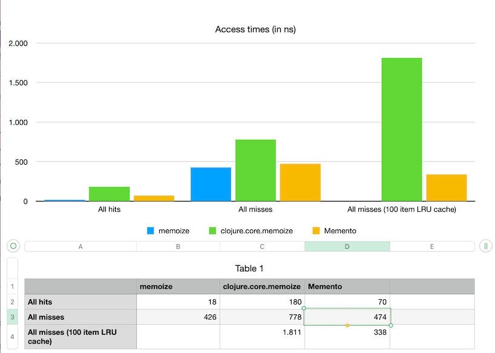
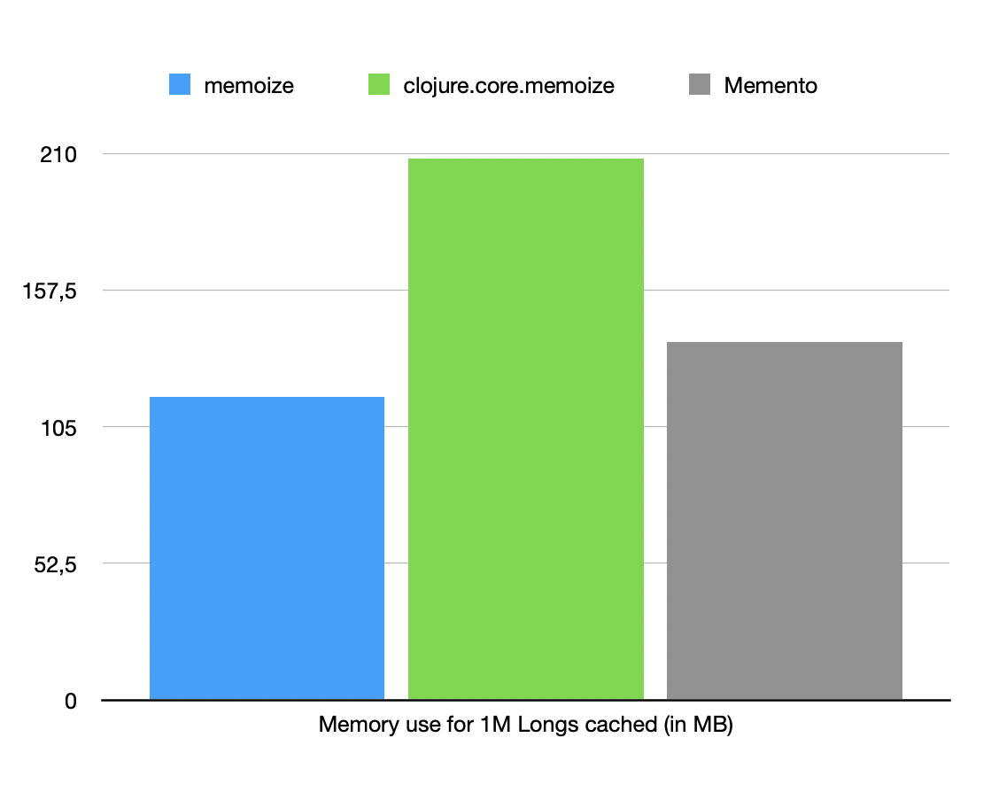

# Performance

Performance is not a dedicated goal of this library, but here's some numbers.
Measurements below were rerun with Criterium 0.4.6, Caffeine 3.2.4, and Java 17.





```clojure
; memoize is not thread-safe and doesn't have any features
(def f-memoize (memoize identity))
; clojure.core.memoize
(def f-core-memo (ccm/memo identity))
; memento
(def f-memento (m/memo identity {::m/type ::m/caffeine}))
; memento caffeine variable expiry
(def f-memento-var (m/memo identity {::m/type ::m/caffeine ::m/expiry memento.caffeine.config/meta-expiry}))
; memento lite caffeine (without secondary-index bookkeeping)
(def f-lite-memento (m/memo identity {::m/type ::m/lite}))
```
## Memoize

#### All hits
```text
(cc/bench (f-memoize 1))
Evaluation count : 7764035640 in 60 samples of 129400594 calls.
             Execution time mean : 6,436432 ns
    Execution time std-deviation : 0,101588 ns
   Execution time lower quantile : 6,321837 ns ( 2,5%)
   Execution time upper quantile : 6,658037 ns (97,5%)
                   Overhead used : 1,306678 ns

Found 5 outliers in 60 samples (8,3333 %)
	low-severe	 4 (6,6667 %)
	low-mild	 1 (1,6667 %)
 Variance from outliers : 1,6389 % Variance is slightly inflated by outliers

```

#### 1M misses (426ns per miss)
```text
(cc/bench (let [f-memoize (memoize identity)]
            (reduce #(f-memoize %2) (range 1000000))))
Evaluation count : 180 in 60 samples of 3 calls.
             Execution time mean : 426,691729 ms
    Execution time std-deviation : 31,649211 ms
   Execution time lower quantile : 407,433346 ms ( 2,5%)
   Execution time upper quantile : 500,285216 ms (97,5%)
                   Overhead used : 1,997090 ns

Found 9 outliers in 60 samples (15,0000 %)
	low-severe	 5 (8,3333 %)
	low-mild	 4 (6,6667 %)
 Variance from outliers : 55,1467 % Variance is severely inflated by outliers
```

## Clojure Core Memoize

#### All hits

```text
(cc/bench (f-core-memo 1))
Evaluation count : 1099203240 in 60 samples of 18320054 calls.
             Execution time mean : 53,780619 ns
    Execution time std-deviation : 1,023984 ns
   Execution time lower quantile : 52,156068 ns ( 2,5%)
   Execution time upper quantile : 55,690610 ns (97,5%)
                   Overhead used : 1,306678 ns
```

#### 1M misses (778 ns per miss)

```text
(cc/bench (let [f-core-memo (ccm/memo identity)]
            (reduce #(f-core-memo %2) (range 1000000))))
Evaluation count : 180 in 60 samples of 3 calls.
             Execution time mean : 464,700916 ms
    Execution time std-deviation : 23,764305 ms
   Execution time lower quantile : 446,921638 ms ( 2,5%)
   Execution time upper quantile : 515,232370 ms (97,5%)
                   Overhead used : 1,306678 ns

Found 6 outliers in 60 samples (10,0000 %)
	low-severe	 4 (6,6667 %)
	low-mild	 2 (3,3333 %)
 Variance from outliers : 36,8701 % Variance is moderately inflated by outliers
```

#### 1M misses for size 100 LRU cache (1811 ns per miss)

```text
(cc/bench (let [f-core-memo (ccm/lru identity :lru/threshold 100)]
            (reduce #(f-core-memo %2) (range 1000000))))
Evaluation count : 120 in 60 samples of 2 calls.
             Execution time mean : 815,914797 ms
    Execution time std-deviation : 43,526219 ms
   Execution time lower quantile : 788,598103 ms ( 2,5%)
   Execution time upper quantile : 923,646012 ms (97,5%)
                   Overhead used : 1,306678 ns

Found 9 outliers in 60 samples (15,0000 %)
	low-severe	 9 (15,0000 %)
 Variance from outliers : 38,5359 % Variance is moderately inflated by outliers

```

## Memento

#### All hits

```text
(cc/bench (f-memento 1))

Evaluation count : 1718078460 in 60 samples of 28634641 calls.
             Execution time mean : 33,942394 ns
    Execution time std-deviation : 0,349780 ns
   Execution time lower quantile : 33,618991 ns ( 2,5%)
   Execution time upper quantile : 34,806259 ns (97,5%)
                   Overhead used : 1,306678 ns

Found 5 outliers in 60 samples (8,3333 %)
	low-severe	 3 (5,0000 %)
	low-mild	 2 (3,3333 %)
 Variance from outliers : 1,6389 % Variance is slightly inflated by outliers


```

#### 1M misses (309 ns per miss)

```text
(cc/bench (let [f-memento (m/memo identity {::m/type ::m/caffeine})]
            (reduce #(f-memento %2) (range 1000000))))
Evaluation count : 240 in 60 samples of 4 calls.
             Execution time mean : 308,751682 ms
    Execution time std-deviation : 33,132693 ms
   Execution time lower quantile : 255,539874 ms ( 2,5%)
   Execution time upper quantile : 368,763603 ms (97,5%)
                   Overhead used : 1,306678 ns

Found 1 outliers in 60 samples (1,6667 %)
	low-severe	 1 (1,6667 %)
 Variance from outliers : 72,1172 % Variance is severely inflated by outliers

```

#### 1M misses for size 100 LRU cache (167 ns per miss)

```text
(cc/bench (let [f-memento (m/memo identity {::m/size< 100 ::m/type ::m/caffeine})]
            (reduce #(f-memento %2) (range 1000000))))
Evaluation count : 420 in 60 samples of 7 calls.
             Execution time mean : 166,941936 ms
    Execution time std-deviation : 3,776379 ms
   Execution time lower quantile : 161,348356 ms ( 2,5%)
   Execution time upper quantile : 174,141084 ms (97,5%)
                   Overhead used : 1,306678 ns


```

## Memento Lite

The lite cache skips secondary-index bookkeeping. It is intended for workloads that
do not use secondary-ID invalidation.

#### All hits

```text
(cc/bench (f-lite-memento 1))

Evaluation count : 806119140 in 60 samples of 13435319 calls.
             Execution time mean : 74,053221 ns
    Execution time std-deviation : 0,792300 ns
   Execution time lower quantile : 72,913685 ns ( 2,5%)
   Execution time upper quantile : 75,194691 ns (97,5%)
                   Overhead used : 1,306678 ns
```

#### 1M misses (298 ns per miss)

```text
(cc/bench (let [f-lite-memento (m/memo identity {::m/type ::m/lite})]
            (reduce #(f-lite-memento %2) (range 1000000))))
Evaluation count : 240 in 60 samples of 4 calls.
             Execution time mean : 298,351475 ms
    Execution time std-deviation : 33,728170 ms
   Execution time lower quantile : 237,266474 ms ( 2,5%)
   Execution time upper quantile : 358,873186 ms (97,5%)
                   Overhead used : 1,306678 ns

Found 1 outliers in 60 samples (1,6667 %)
	low-severe	 1 (1,6667 %)
 Variance from outliers : 75,4690 % Variance is severely inflated by outliers
```

## Memento Variable Expiry

#### All hits

```text
(cc/bench (f-memento-var 1))

Evaluation count : 401291400 in 60 samples of 6688190 calls.
             Execution time mean : 152,626969 ns
    Execution time std-deviation : 1,931622 ns
   Execution time lower quantile : 149,201120 ns ( 2,5%)
   Execution time upper quantile : 156,051821 ns (97,5%)
                   Overhead used : 1,306678 ns

Found 1 outliers in 60 samples (1,6667 %)
	low-severe	 1 (1,6667 %)
 Variance from outliers : 1,6389 % Variance is slightly inflated by outliers

```

#### 1M misses (428 ns per miss)

```text
(cc/bench (let [f-memento-var (m/memo identity {::m/type ::m/caffeine ::m/expiry memento.caffeine.config/meta-expiry})]
            (reduce #(f-memento-var %2) (range 1000000))))
Evaluation count : 180 in 60 samples of 3 calls.
             Execution time mean : 427,820875 ms
    Execution time std-deviation : 37,593499 ms
   Execution time lower quantile : 364,979096 ms ( 2,5%)
   Execution time upper quantile : 497,178634 ms (97,5%)
                   Overhead used : 1,306678 ns

Found 1 outliers in 60 samples (1,6667 %)
	low-severe	 1 (1,6667 %)
 Variance from outliers : 72,1172 % Variance is severely inflated by outliers

```

#### 1M misses for size 100 LRU cache (197 ns per miss)

```text
(cc/bench (let [f-memento-var (m/memo identity {::m/size< 100 ::m/type ::m/caffeine ::m/expiry memento.caffeine.config/meta-expiry})]
            (reduce #(f-memento-var %2) (range 1000000))))
Evaluation count : 360 in 60 samples of 6 calls.
             Execution time mean : 196,713730 ms
    Execution time std-deviation : 4,167433 ms
   Execution time lower quantile : 188,982422 ms ( 2,5%)
   Execution time upper quantile : 203,172728 ms (97,5%)
                   Overhead used : 1,306678 ns

Found 1 outliers in 60 samples (1,6667 %)
	low-severe	 1 (1,6667 %)
 Variance from outliers : 9,4198 % Variance is slightly inflated by outliers

```
